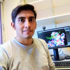

title: About Me
date: 2019-06-24
modified: 2019-06-24
status: published

# Education

### PhD student
Ciencias Biomédicas (Biomedical Sciences).Universidad Nacional Autonoma de México (UNAM). México.
Drug Design. University of Groningen. The Netherlands.

### Master of Sciences 
Ciencias Quimicobiológicas (Biochemistry); Escuela Nacional de Ciencias Biológicas (ENCB). May 2017.
Instituto Politécnico Nacional (IPN). México. 

### Bachelor of Sciences
Químico Farmaceútico Biólogo (Pharmaceutical chemist); Facultad de Química, March 2015. 
Universidad Nacional Autonoma de México (UNAM). México.

# Research Interests

Design and evaluation of new treatments for novel targets using cheminformatic, and bioinformatic approaches.

# More about Me

I love science, tacos, beer, and chat. So simple, so easy.

